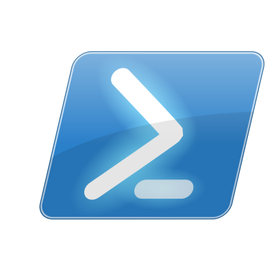

# Turing Completeness

For digital computers there are limits to what can be computed, both
in terms of time and memory, but also in terms of what is
theoretically possible.  In the 1930s these limits were explored
separate by Gödel, Church and Turing.

## UTM

The most well known model of computation is the Univeral Turning
Machine, a theoretical machine which can emulate any real computer.
The corollary is that any machine capable of emulating an UTM can
therefore emulate any other form of digital computation.

A language, including machine assembly, can be said to be Turing
Complete if it can emulate a UTM.  Not all languages are Turing
Complete, either because they do not support recursion, or a domain
specific and do not require full generality.

# Machine Organisation

While many languages, especially scripting languages, abstract away
the underlying CPU architecture, others match variable types directly
to types defined by the CPU ISA (Instruction Set Architecture).

## Registers

Fundamental to a CPU is the register set.  Registers have a number of
types and sizes.  For example the 6502 had a single 16-bit address
register (the PC or progam counters, so it could address up to 64K bytes
of memory), a single 8-bit accumulator which could be used for arithmetic,
three 8-bit address indexing registers (X, Y and SP) and an 8-bit machine
status register.

Some architectures (for example the Motorola 68000) have separate
registers for holding memory addreses (address registers) and doing
integer arithmetic (data registers) while others, such as the
RISC-V64, have a single set of 64-bit general purpose registers.

Specialized arithmetic units such as FPUs (Floating Point Units) and
SIMD units such as SSE3/SSE4 have their own register sets.

## Smallest addressable memory

Within an ISA registers (and instructions) can hold memory locations
which can be loaded or stored to.  The size of the location is known
as the word size.  This has varied over time but all modern CPUs have
an 8-bit word size, and a known as byte addressable.  Most 64-bit CPUs
have instructions to load and store bytes, short integers (16-bits),
integers (32-bits) and long integers (64-bits).

## Instruction sets

The list of instructions a CPU will run is known as the instruction
set.  These are formally specified as an Instruction Set Architecture
(ISA).  An ISA can have multiple implementations, such are ARM, or
even X86_64, which is implemented by both Intel and AMD.  Compiled
languages target a specfic ISA and their output should run on all CPUs
conformant to the ISA, however all ISAs have revisions, extensions and
errata, so code compiled to run optimally on the latest CPU may not
run on an older CPU.  In some cases instructions are even depricated
out of an ISA.

# Assembly

Assembly (or Assembly Code) is series of mnemonics to represent
machine instructions (aka opcodes).  This allows a programmer to write
to an ISA without having to know the binary representation of the
instuction.  While assembly code and assemblers improved coding speed
and quality all assembly code is ISA specific, so any program written
in assembly needed to be re-written for a new CPU architecture.

While large programs avoid assembly code it is can be found in
operating system source, or low level libaries, especially where
performance is at a premium.  This is often just as small number of
functions that are called very frequently as part of a larger
computation.

## RISCV64 

~~~
        .file   "hello.c"
        .option nopic
        .text
        .align  1
        .globl  main
        .type   main, @function
main:
        add     sp,sp,-48
        sd      ra,40(sp)
        sd      s0,32(sp)
        add     s0,sp,48
        mv      a5,a0
        sd      a1,-48(s0)
        sw      a5,-36(s0)
        sw      zero,-20(s0)
        j       .L2
.L3:
        lw      a5,-20(s0)
        sll     a5,a5,3
        ld      a4,-48(s0)
        add     a5,a4,a5
        ld      a5,0(a5)
        mv      a0,a5
        call    puts
        lw      a5,-20(s0)
        addw    a5,a5,1
        sw      a5,-20(s0)
.L2:
        lw      a4,-20(s0)
        lw      a5,-36(s0)
        sext.w  a4,a4
        sext.w  a5,a5
        blt     a4,a5,.L3
        li      a5,0
        mv      a0,a5
        ld      ra,40(sp)
        ld      s0,32(sp)
        add     sp,sp,48
        jr      ra
        .size   main, .-main
        .ident  "GCC: (GNU) 7.3.1 20180303 (Red Hat 7.3.1-5)"
~~~

## X86_64 

~~~
        .file   "hello.c"
        .text
        .globl  main
        .type   main, @function
main:
.LFB0:
        .cfi_startproc
        pushq   %rbp
        .cfi_def_cfa_offset 16
        .cfi_offset 6, -16
        movq    %rsp, %rbp
        .cfi_def_cfa_register 6
        subq    $32, %rsp
        movl    %edi, -20(%rbp)
        movq    %rsi, -32(%rbp)
        movl    $0, -4(%rbp)
        jmp     .L2
.L3:
        movl    -4(%rbp), %eax
        cltq
        leaq    0(,%rax,8), %rdx
        movq    -32(%rbp), %rax
        addq    %rdx, %rax
        movq    (%rax), %rax
        movq    %rax, %rdi
        call    puts
        addl    $1, -4(%rbp)
.L2:
        movl    -4(%rbp), %eax
        cmpl    -20(%rbp), %eax
        jl      .L3
        movl    $0, %eax
        leave
        .cfi_def_cfa 7, 8
        ret
        .cfi_endproc
.LFE0:
        .size   main, .-main
        .ident  "GCC: (GNU) 10.1.0"
        .section        .note.GNU-stack,"",@progbits
~~~

# Early Languages (that survive)

Effectly all computer languages today are high level languages, that
is they are not machine code or assembly.  The earliest reference I
could find for a high level language that has a direct lineage to
today is FORTRAN (now Fortran).

## FORTRAN (1957) 

In 1951 IBM produced its first scientific computer, the IBM 701.  One
of the IBM engineers was frustrated with writing assembly and worked
on a method of automating the translation of mathematical formulas
into code.  This evolved into FORTRAN (FORmula TRANslation), a program
which converted a high level description into assembly.  FORTRAN was
designed specifically for computationally intensive numerical work and
was adopted by scientists working on numerical simulations.

The popularity of FORTRAN encourgaged hardware manufacturers to
provide a FORTRAN compiler for their product, which in increased the
use of the language, was code written on one model of hardware could
be recompiled to run completely different hardware with little or no
modification.

## LISP (1958) 

LISt Processor (LISP) is the second oldest language that has supported
modern implementations.  All the modern implementations are a dialect
of the original John McCarthy LISP.  While LISP has never made it to a
mainstream language various dialects such as common LISP, scheme and
Clojure are active.

## ALGOL (1958)

ALGOL is seen as the predecessor to almost all modern languages.  It
was designed by a group of computer scientists and had a structured
approach to its design and implementation.  While the language itself
is now effectively extinct it is seen as the predecessor to C and
Pascal and their descendants.

## COBOL (1959)

Common Business-oriented Language was designed for data processing and
was initially standardized in 1960 but it didn't become an official
ANSI standard until 1966.

The language was updated in 1974 and again in 1985 with amendments in
1989 and 1993.

As shown by the sudden demand for COBOL programmers to update
government payment systems COBOL is very much a going concern.

## BASIC (1964)

BASIC is (to me) surprisingly old and was designed to be easy to use.
Its rise (and fall) of the language is seen as tied to the growth of
microcomputers in late 1970s and 1980s.  Most of the 8-bit home
computers of that era, such as the Apple II, the BBC Micro and the
Commodore VIC-20 and C64, had a BASIC interpreter in ROM and often as
their shell.

In most cases the language was not compiled down to assembly but
instead converted to an internal representation and then run on
effectively an emulator.  While this often resulted in a considerable
performance penalty it allowed programmers to modify and run quickly.

The BASIC still lingers has Microsoft's VB.NET it is endangered and
exists mostly in legacy applications.

## Pascal (1970)

Written by Niklaus Wirth as an attempt to improve apon ALGOL.  It had
a very long life, with the original Macintosh ROM written in Pascal.
A popular varient was Borland's Delphi language and development
environment.  Another important contribution to languages in general
was the development of P-code.  This was an abstact ISA which was a
target of the the UCSD pascal compiler.  P-code was then interpreted
by a highly optimized program on real hardware.  This allowed the
distribution of compiled code that could be run on multiple different
CPUs.

# The Big Beast C (1972) 

The original Unix operating system was written in PDP-7 assembly
before being porting to the PDP-11 (original also in assembly).  The C
language was derived from B, itself derived from BCPL (Basic Combined
Programming Language), from 1967.  BCPL was designed for bootstrapping
new CPU archictures by having a two stage compilation process.

The first stage compiled the code down into an intermediate language,
similar in nature to Pascal's P-code.  The second stage then
translated the O-code (as it was called) into the native assembly.
When a new CPU architecture target was needed only the second stage
needed to be written, often assisted by automated code generating
tables.  This allowed the language to be ported realitively quickly.

The original C language was written by Dennis Ritchie to make writing
utilities for Unix easier.  In 1974 unix was re-implemented in C,
requiring the language to support low level operations, such as bit
and pointer manipulation.

## K&R

Kernighan and Ritchie published "The C Programming Language" in 1978.
The language specified in the book bacame known as K&R C.  For a long
time (up into mid 1990s) this was treated as the standard variant of
C.

## ANSI C

In 1989 the American National Standards Institute (ANSI) published a
formal standard of the C language.  This had a number of syntantic
changes compared to K&R C.  During the 1990s all the running C code
moved from K&R to ANSI C.

## C99

The C standard was officially revised in 1999.  The original ANSI C
became C89.  The language was extended again in 2011 as C11 with an
errata becoming the latest standard, C18.

## Models

As described earlier CPUs have varying CPU register sizes and memory
models.  Languages needed to take these into account.  C, as the main
systems language at the time, ended up with a number of issues around
the size of an integer and pointer.  An example is the M68000 had
32-bit address registers but its actual memory bus was only 24 bits,
so the top 8 bits of an address were ignored, or the segmented memory
model of the 8086 and 80286, so while the address registers were only
16 bits wide the use of segment registers extended this to 20 bits of
actual addressable memory.  While this was useful for extended the
memory it broke pointer equality since segments overlapped.

The C language was original written for PDP11, a 16-bit minicomputer.
It greatly expanded in popularity with rise of unix workstations.
These were all based on 32-bit CPUs (at the time) such as Silicon
Graphics Iris [MIPS CPUs], Sun (originally M68000 then SPARC), Apollo
(original M68000 then PA-RISC), IBM RS6000 and VAX stations.  Therefore
the size of int (integer) and pointers both ended up as 32-bits in
most C implementations.

### ILP32

The ILP32 (int/long/pointer) model was the standard model throughout
the 1980s and early 1990s until the rise of 64-bit CPUs (see below).
The standard sizes became as below.

Type      | Size   | Desc
--        | --     | ----
char      | 8      | The size of an ASCII or ISO8859 character
short     | 16     | Not used much, except in networking sure as port numbers
int       | 32     | Standard integer size
long      | 32     | Integer sized == pointer
void*     | 32     | Size of a pointer (ie a memory address)
long long | 64     | Rarely used orignal except for counters, later for large file systems
float     | 32     | Single precision floating point
double    | 64     | Double precison floating point

With integers being the same size as pointers main pieces of code
would assign pointers to integers (and back again).  When 64-bit CPUs
came on the market many pieces of software broke, was pointers were
assigned to integers, which truncated the 64-bit value into a 32-bit
value.

### LP64

While DEC with its Alpha ISA decided that an int should be 64 bits
wide (breaking lots of code) most vendors decided the lesser evil was
to keep int as 32 bits wide and make long 64 bits, to equal the width
of pointers.  This is known as the LP64 (long/pointer) model and is
standard today on all current 64-bit architectures (RISCV / SPARC /
POWER / ARM / MIPS / X86_64).

# Ada (1980) 

This language is heavily used within the US DoD, especially in
critical systems such as flight controller for jets.  It has a special
focus on language safety (in terms of strong typing, run-time dyanmic
memory checking).

# Libraries and modules

All programs need to interact with the environment, normally through
system calls to the underlying OS or VM.  These calls are normally
abstracted away from the programmer by hiding them beyond functions
within the language.  These functions are collected into sets, known
generally as libraries or modules.

Most languages come with some form of standard libraries, such as the
standard C library.  All languages over time build an ecosystem around
them, from tools to modules and libraries to different VMs or
debuggers.  These are known collectively as packages.

Some languages have some form of package management and central
repository, often modelled of the Comprehensive TeX Archive Network
(CTAN).  Perl, for example, has CPAN while R has CRAN.  Python
uses PyPI while rust has Cargo and Crates.

## Bindings

Many languages (especially scripting languages) make available
functions from a library written in another language.  The converse is
also true, where a library will make available functions to another
language.  In both cases this is called language bindings.  For
example the graphics libary Cairo is written in C but can be called
from perl using the Cairo module.  The module dynamically loads the
cairo library into the running perl process and converts perl data
structures into their C equivilent before calling the C functions.

Over the years many attempts have been done to standardize function
calls between computers, libraries and languages, but most have
failed.  Current examples are Apache Thrift and Google's gRPC.

## Dependency Hell

Most programs are not tabula rasa (ie clean sheet) but rely on
existing libraries and modules, either as compile time or runtime.
These are either language modules, or shared libraries (or DLLs for
windows).  This creates a dependency on the module, which in turn can
have dependencies of its own.  These dependencies can become very
complex and occassionaly mutually exclusive, leading to dependency
hell.  Much of the work around package management is handling these
dependencies and versioning.

# Scripting (and Shell) Laguages

Scripting languages and shells are generally interpreted, but some do
support compilation.  Shells, such as the unix Bourne shell and the
DOS shell are Turing Complete (according to the crowd), but were not
(are are no) designed for writing large complex programs.  They are
often very weak at computation but have complex flow control
structures, making them good for job control.

## Bourne Shell (1979)

While not the first or only unix shell (Korn, C, Bash) it is seen as
the canonical unix shell.  However without even weak typing or complex
data structures it is extremely difficult to program and ineffecient
to run complex programs.

## Perl (1987) { width=100pt }

Perl, while waining in popularity, is still very prevelent on unix
systems, especially for low level system scripting.  It is very strong
on regular expression pattern matching, making it ideal for parsing
messy text output.  The current version of perl is 5.30.3 and
is still actively maintained.

While perl4 has arrays (numerically indexes lists) and associative
arrays (aka hashes or dictionaries) it was the ability to create
references to these in perl5 to create complex (often deeply nested or
even recursive) data structures.  These show up in JSON as fundamental
building blocks, along with string, number (floating point) and
boolean scalars.

## Python (1990) 

Currently contenting with Javascript (and its derivitives) as the king
of the scripting languages, it is popular both as an application
programming language and as a systems language.  While it recently
ended support for Python2 there is still a long tail of code which had
not been ported to Python3, itself having several revisions (currently
python 3.8).

## Lua (1993) 

Lua is designed not as a general programming language but as an
embedded scripting language, to allow existing programs to extend
their functional in a controlled fashion.  An example of this is the
World of Warcraft client, which allows addons written in lua to be
run.  The language itself is simple (but TC), much of its feature
comes from its ability to integrate well with existing C and C++
programs.

## PHP (1995) 

While the earliest HTTP servers such as CERN and Apache started with
just serving static pages it became quickly apparent that the ability
to dynamically produce content would transform the web experience.
This was initially done via the Common Gateway Interface (CGI),
effectively just a standard set of environment variables passed by the
HTTP daemon to a script, which returned the page back to the daemon to
be sent to the client.

Early CGI scripts were mostly shell or perl, with handwritten parsers
and simple frameworks.  PHP (originally standing for Personal Home
Page) was a language written specifically to run as a HTTP backend for
dynamic pages.

Standard PHP is byte compiled to run on the Zend Engine and comes with
a number of database integration backends as part of the standard
distribution.

### Hack and HHVM

Facebook created a derivitive of PHP called Hack and a virtual machine
called Hiphop VM (HHVM) to run it on.

## Ruby (1995) 

The Ruby language is a functional language with OO.  Its major
contribution is the web backend framework called Ruby On Rails.  Its
popularity was extended by its use in the orchestrational tools Puppet
and Chef.

## Javascript (1995) 

Originally invented by Netscape as a browser side embedded language
for HTML pages it was not until 2009 that it become standardized as
ECMAscript 5.  Further standards were released in 2015 (ECMAscript 6)
and yearly afterward.

It is supported (at varying levels of compatibility) by all the major
browsers and may be considered the most widely used language currently
in use.

In addition there are a number of server side implementations, in
particular node.js.  The original language itself was fairly limited
and relied of a large number of functions provided by the browser VM.

### CoffeeScript (2009)

Many regarded (and regard) Javascript as an ugly language and instead
of being written directly a number of languages use it as a target
language to be compiled into.  CoffeeScript is an early example of
this.

### TypeScript (2012)

Developed by Microsoft to improve code quality of large javascript
projects by adding improved typing and a form of header file.  Support
by Microsoft in Visual Studio has given the language a strong backing
and continued support.

## Powershell (2006) { width=50% }

Developed by Microsoft was a standard method of performing windows
management with a focus on automation.  The language was based around
the .NET framework and allowed .NET data structures to be passed
between functions, known as commandlets.  This allowed for the
manipulation of complex data through a pipeline of operations.

In 2018 the language was ported to Linux and MacOS, based around the
.NET Core libraries.  The most recent version, Powershell 7, merges
the existing .NET Framework of Powershell 5.1 on Windows with the .NET
Core of Powershell 6.

# Current Contenders

## Object Oriented (OO) Programming

Started ing 1972 and released in 1980 the language Smalltalk was
influential in the development of Object Oriented languages.  While
previously functions worked on complex data structures in OO languages
functions were bound to data structures in the form of a class,
becoming class methods.  A class can be derived from another class in
the form of inheritance, gaining additional members (variables) and
methods (functions).  By allowing class members to be overwritten
during inheritence it began possible for an instance of a class to be
different at runtime then compile time and still work correctly.

## Garbade Collections

Programs that require additonal memory at runtime can do so by
requesting blocks of memory from the operating system.  Unix, and
correspondingly C, use the functions malloc and free to request and
free memory from the OS.  In C++ these are the new and delete
operators and have a similar function.  The collection of allocated
memory is known as the heap.  Three major issues can occur due
to the use of dynamic memory allocation.

- Over time a program that continually requests and deletes memory
from the heap can cause heap fragmentation.
- Memory can be allocated, used then not freed, heading to memory
leakage.  Over time a process will consume more and more memory until
the OS kills it.
- Memory can be freeded in one part of the code while another still has
a reference to it, causing the program to either fault or produce
incorrect results.

Dyanmic memory management is the bane of all programmers and many languages
have support (or supplimental libaries) to assist.  These general
come in either restrictions within the language, the use of reference
counters, or automated garbage collection.

With garbage collection the language runtime will attempt to find
blocks of allocated memory without any references to them and
automatically free them.  Debates continue about the efficacy of
garbage collection and its effects on runtime performance.

## C++ (1985) 

Originally billed as C with objects C++ has become a major language in
its own right.  The language is very feature rich (although it doesn't
have runtime garbage collection).  By extending C the language can use
C language functions and data structures, allowing it access to a vast
array of C language libraries.  It also has a two large libraries of
functions, the Standard Template Library (STL) and the boost library.

C++ allows for a limited amount of runtime introspection in the form
of run time type information (RTTI).  This allows the querying of a
pointer and conditional pointer casting (dynamic_cast).

## Java (1995) 

The early 1990s was the age of unix workstations.  This was a time of
multiple unix flavours on multiple different CPU architectures and the
rise of MacOS and Windows as server platforms.  Anybody writing code
at the time had to deal with writing conditional code based on the OS
and CPU, depending on if and how a function or library was implemented.

Sun Microsystems resolved to fix this with a compile once, run many
language by using a runtime JIT (Just In Time) VM.  The Java language
is in many ways a reworking of C++ and was split into the Java SDK
(Software Development Kit) and the JRE (Java Runtime Environment).
Source code was compiled into .class files, which can be either
interpted or JIT compiled by the JRE.  The runtime included a garbage
collector, an OS adaption layer and a windowing (GUI) abstraction
library (AWT).

Java is still widely used for business applications and for a while
was very popular for utilities but many consider the JRE very
heavyweight and therefore inappropriate for system programs and has
gradually been superceded by Go and Rust.

The language made an ill-fated attempt to become language of the web
by embedding a JRE inside the browser, allowing applications to be
launched on a client machine while being delivered by a web server.  A
long string of security and performance issues, along with
incompatible language changes, resulting in this being less than
welcome and was relegated to a few niche applications by flash then
Javascript and possibly webassembly in the future.

## C\# (1999) 

Started in 1999 during the development of the Microsft .NET framework
the language is both similar and different to C++ and Java and is
widely used for developing applications on Microsoft Windows.  While
Microsoft has ported the much of the .NET framework to Linux and MacOS
via the .NET Core project, and the clean room open source project mono
also ported the languge to Linux is still very much tied to the
Microsoft Windows platform.

## Go (2007) 

Go was developed in Google as another re-implementation of C with
objects.  The languge has a strong focus on concurrency and package
management.  The language can build native executables for a number of
modern operating systems (and ISAs) and includes a small runtime
execution environment within the executable so that it the final
binary does not rely on an external library.

The Go runtime also provides an OS abstaction layer so it possible to
compile a go program for say windows and linux from linux (effectively
cross compile to windows).  This makes is ideal for system utilities.

## Rust (2010) 

Developed by Mozilla as a replacement for C++, it is designed around
memory and concurrency safety.  It is not garbage collected or by
default referenced counting, but relies heavily on static analysis and
language features to ensure dynamic memory safety.

There are a number of projects using rust to implement partial and
full operating systems, for example AWS's replacement for QEMU as an
virtual machine manager (VMM) Firecracker is written in rust.

# Odds and Sods

## Forth (1970)

## Prolog (1972)

## Erland (1986)

## R (1993)

## Dart (2011)

## Julia (2012)

## Scala (2004)

Functional language using JVM.

## WebAssembly (2017)

## Kotlin (2011)

Uses JVM for android.

## Haskell (1990)

## Swift (2014)

Developed by Apple for IOS.

## Tcl/Tk (1988)

